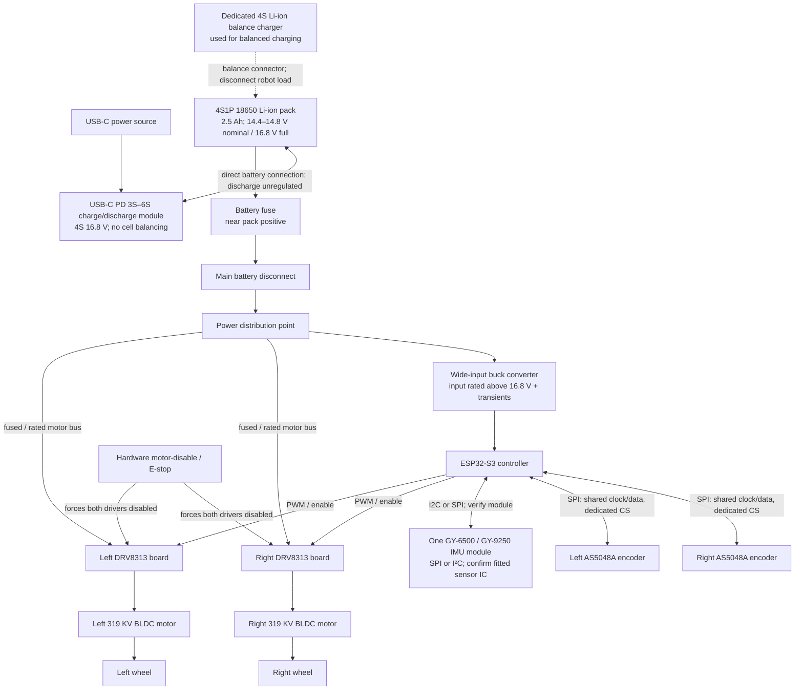

# Balancing Robot — Hardware Architecture

## System overview

The design is split into a high-current motor path and a regulated logic/sensing path. They share a deliberate ground reference, but motor-current return paths should not run through the IMU or encoder ground wiring.

The pack is assumed to be 4S1P: four matched 2500 mAh 18650 Li-ion cells in series, giving 2.5 Ah and approximately 36–37 Wh. Its nominal voltage is cell-dependent (typically 14.4–14.8 V) and full charge is 16.8 V. The selected USB-C module does not balance cells, and its discharge path is directly connected to the battery. The robot's motor bus is supplied directly from the pack through suitable fuse, disconnect, wiring, and distribution; the module adds no current limit. The user confirms the cells are rated for 20 A continuous discharge; verify this against the exact cell datasheet once the model is known. Use a dedicated 4S Li-ion balance charger through the pack's balance connector for balanced charging, with the robot load disconnected. The module is not a BMS or cell balancer.

## Power and grounding

1. Route battery power directly to the robot through a fuse close to pack positive, an appropriately rated disconnect, and a distribution point. The USB-C module's discharge connection is direct to the battery and does not limit robot current. Size the fuse, wire, connectors, and distribution for the battery's possible fault/peak current and the selected system limits; do not rely on the module for current limiting.
2. From the distribution point, feed both driver boards from the motor bus. Check the exact driver-board voltage rating at the module level. A 4S pack ranges from 16.8 V fully charged downward during discharge; braking/regeneration and wiring inductance can create transients above the pack voltage.
3. Feed a genuine step-down buck converter from the battery distribution point to the documented input voltage of the ESP32-S3 board. The supplied XL6009 listing is not suitable for this job: XL6009 is a boost (step-up) topology and cannot reduce the 4S pack voltage to 5 V, despite the listing's buck-boost wording. Do not assume a dev board accepts a particular voltage on a pin without its schematic. Power sensors from a regulated rail only after checking their module requirements and available current.
4. Establish a common signal-ground reference between MCU and driver control inputs. Join power returns at a planned distribution/star point. Keep high-current motor and battery return currents out of IMU/encoder return paths; route sensitive signals away from motor phase wires.
5. Provide appropriate local DC-link capacitance at each driver as specified by its board design. Validate for regenerative behavior and battery disconnects; the DRV8313 silicon's headline limits do not guarantee the board can absorb transients.
6. The USB-C module does not balance cells. Use a compatible dedicated 4S Li-ion balance charger through the pack balance connector for balanced charge cycles; disconnect the robot load and do not connect both charging sources simultaneously unless the system is specifically engineered for it. Verify cell polarity, cell matching, insulation, interconnects, and protection before charging. Follow the charger and battery instructions, charge on a suitable surface, and supervise charging.

## Control and signal topology

| Connection | Proposed topology | Items to verify before wiring |
|---|---|---|
| IMU to ESP32-S3 | One GY-6500/GY-9250 module; SPI or I²C | User confirms one module with SPI/I²C connection. Select one interface and verify the module's mode-selection pins, actual sensor IC, breakout schematic, supply/logic levels, pull-ups or chip-select wiring, and interrupt availability. Keep the IMU rigidly mounted near the chassis center and axle plane. |
| Two AS5048A encoders to ESP32-S3 | Power each module from 3.3 V for direct logic compatibility; shared SPI clock/data with one chip-select per encoder (planned); PWM outputs are an alternative | User confirms the modules can run at 3.3 V or 5 V and the A version. AS5048A supports SPI and PWM, not I²C. Using the 3.3 V rail avoids 5 V signal-level concerns; confirm module pinout, SPI timing, MISO behavior when deselected, PWM configuration if used, and magnet alignment/air gap. |
| ESP32-S3 to each driver | Driver-board-supported PWM inputs plus enable and fault signals where exposed | Confirm whether the exact board accepts 3-PWM or 6-PWM, input voltage thresholds, PWM frequency/dead-time requirements, polarity, fault behavior, and MCU pin/timer availability. Do not assign pins until the exact ESP32-S3 board is selected. |
| Driver to motor | Three phase outputs per BLDC motor | Confirm motor phase current and driver board continuous/peak ratings, cooling, and phase wiring. Identify motor pole pairs for FOC configuration. |
| Emergency stop to drivers | Hardware path that forces both driver boards disabled | Follow the board's specified enable/sleep polarity and provide a safe hardware default during reset, boot, and MCU power loss. The software command alone is not an emergency stop. |
| USB-C module and pack | Module has USB-C PD input/output and direct battery discharge connection | User confirms no cell balancing and no module-imposed discharge-current limit. Confirm exact connector polarity and wiring from the board documentation. Treat battery, wiring, connectors, fuse, and drivers as the current-limiting/safety elements. |
| Dedicated balance charger to pack | Compatible 4S Li-ion charger connected to the pack's balance port | Use for balancing charge; disconnect robot load. Do not parallel charge sources unless an engineered power path explicitly allows it. |

Keep the IMU and encoder signal wiring short and away from switching nodes and motor phase leads. If an SPI bus is shared, confirm that every device tolerates the same bus voltage and releases MISO when not selected; otherwise use separate buses or suitable isolation.

### Corrected provisional ESP32-S3 pin plan

This plan supersedes the earlier pin map on `agents/getting-started-with-coding`.
It is documentation only; firmware does not configure these pins. Confirm the
actual DevKitC-1 revision and all breakout schematics before wiring. Driver
assignments assume a verified 3-PWM interface; a different interface requires a
new allocation.

| Signal | Proposed GPIO | Notes |
|---|---|---|
| Shared sensor SPI SCK / MISO / MOSI | 7 / 6 / 5 | IMU and both encoders; configure SPI mode/speed per device and verify MISO release |
| IMU CS / optional interrupt | 4 / 17 | Verify mode-selection and interrupt polarity |
| Left / right encoder CS | 15 / 16 | Separate chip selects on the shared SPI bus |
| Left PWM A / B / C | 8 / 9 / 10 | No output enabled by current firmware |
| Left enable / fault | 11 / 12 | Verify polarity and hardware disable defaults |
| Right PWM A / B / C | 13 / 14 / 18 | No output enabled by current firmware |
| Right enable / fault | 21 / 40 | Verify polarity and hardware disable defaults; reserve GPIO40 from JTAG |
| E-stop status input | 39 | Monitoring only; the physical E-stop must independently disable both drivers |
| External status LED | 2 | Requires an external LED and resistor; not the onboard RGB LED |
| Battery sense | 1 (ADC1_CH0) | Divider/filter/protection and calibration TBD; never connect the pack directly |
| Debug UART TX / RX | 43 / 44 | Reserved for debug |

The ESP32-S3 has GPIO0–21 and GPIO26–48; **GPIO22–25 do not exist**. Reserve
GPIO19/20 for native USB, GPIO26–37 for flash/PSRAM, and GPIO0/3/45/46 for
strapping constraints. GPIO33 has no ADC function and is not a battery-sense
candidate. Reserve both GPIO38 and GPIO48 for board LED/revision differences;
this plan uses neither. GPIO39/40 are assigned to safety/fault monitoring, so
external JTAG using those pins is unavailable with this allocation; use USB or
UART debugging instead.

Sources: [Espressif GPIO restrictions](https://docs.espressif.com/projects/esp-idf/en/v5.4/esp32s3/api-reference/peripherals/gpio.html)
and [DevKitC-1 board guide](https://docs.espressif.com/projects/esp-dev-kits/en/latest/esp32s3/esp32-s3-devkitc-1/user_guide_v1.0.html).

## Safety and bring-up sequence

1. **Document exact parts:** record part numbers, revisions, schematics, motor datasheets, battery discharge rating, wheel dimensions, and connector/wire ratings.
2. **Power rails only:** with motors disconnected, verify battery polarity, fuse/disconnect action, buck output, board input limits, sensor supply, and signal logic levels. Check that drivers remain disabled through reset and boot.
3. **Sensors only:** test IMU identification, orientation/axis signs, calibration, encoder angle/direction, and magnet alignment. Verify the AS5048A reading across a full shaft revolution.
4. **Driver checks:** verify each board's PWM/enable interface and fault handling with the motor supply current-limited where possible. Confirm the physical motor-disable path before attaching wheels or allowing motion.
5. **Secured motor tests:** secure the chassis with wheels clear of the ground, limit current and supply energy, and test one motor at a time at low command. Verify direction, encoder sign, pole-pair configuration, and behavior on disable/fault.
6. **Closed-loop tests:** start with conservative current and controller limits. Tune with the robot supported and an independent physical battery disconnect accessible. Stop if a driver, motor, battery, or wiring heats unexpectedly.

Never leave the Li-ion pack charging unattended. Do not charge a swollen, damaged, or overheated cell. A firmware crash or loss of USB must not leave either motor energized.

## Important open decisions

- ESP32-S3-DevKitC-1 with N16R8 module is selected (16 MB flash, 8 MB PSRAM); board revision remains TBD. Check its exact schematic for pin availability, USB/5 V power-input path, PWM/timer allocation, and peripheral pin conflicts before assigning signals. GPIO is 3.3 V logic and not 5 V tolerant.
- One IMU module is confirmed, with SPI/I²C connectivity. The supplied [listing](https://www.aliexpress.com/item/1005007211455522.html) advertises the MPU-9250; the board is marked “MPV-9250/6500” on the front and “V356” on the back. These markings may indicate alternative sensor variants. GY-6500 is typically MPU-6500-based (accelerometer + gyroscope); GY-9250 is typically MPU-9250-based (adds a magnetometer). Verify the actual fitted IC, schematic, interface-selection pins, supply/logic levels, and regulator/level shifting. AS5048A encoder variant is confirmed; modules can run at 3.3 V or 5 V, so 3.3 V operation is planned for direct ESP32-S3 logic interfacing. Use SPI or PWM, not I²C.
- DRV8313 driver-board listing is identified ([AliExpress item 1005009566990153](https://www.aliexpress.com/item/1005009566990153.html)); the listing advertises 8–35 V and 2.5 A, but the board manufacturer/model, continuous-versus-peak current meaning, thermal rating, current-sense path, PWM mode, and fault/enable wiring remain to be confirmed.
- The supplied [AliExpress motor listing](https://www.aliexpress.com/item/1005012963517705.html) is confirmed as the selected motor, and the user confirms its 319 KV rating. The wheels will be direct-drive (no gearbox). The listing describes a 12–24 V low-speed gimbal motor and advertises <18.65 W, but does not specify pole-pair count, phase/current limits, or detailed mechanical dimensions. Obtain or measure these; also determine wheel diameter/mass, shaft/hub fitment, and expected peak/stall current.
- Exact 18650 cell model to verify its user-confirmed 20 A continuous rating; battery protection, pack construction, and balance lead; fuse/wiring/connectors; suitable step-down buck converter output/current (the supplied XL6009 boost module cannot perform this step-down); and exact 4S Li-ion balance charger. Confirm module connector polarity and any cell-level protection provided elsewhere in the battery system.
- Whether the selected FOC mode needs added phase-current sensors and battery voltage/current measurement.

At 319 KV, the ideal no-load speed estimate is $319\,\mathrm{rpm/V} \times 14.8\,\mathrm{V} \approx 4{,}715\,\mathrm{rpm}$ nominal and $319\,\mathrm{rpm/V} \times 16.8\,\mathrm{V} \approx 5{,}359\,\mathrm{rpm}$ at full charge. KV alone does not establish torque, stall current, loaded speed, driver suitability, or whether direct drive is appropriate.

The motor-disabled sensor bench now uses the confirmed SPI wiring above, with
per-device modes and 1 MHz clocks. GPIO configuration is opt-in; see
[bring-up instructions](../software/sensor-bringup.md).
