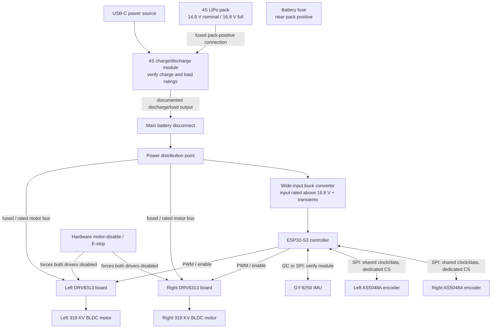

# Balancing Robot — Hardware Architecture

## System overview

The design is split into a high-current motor path and a regulated logic/sensing path. They share a deliberate ground reference, but motor-current return paths should not run through the IMU or encoder ground wiring.

The 4S charge/discharge module is part of the battery power path in this architecture. Connect its pack and load terminals exactly as documented by its manufacturer; do not bypass its protection or assume its discharge output can support motor peaks. Whether the robot can remain connected or operate during charging depends on the module's documented power-path behavior and ratings.

## Power and grounding

1. Connect the pack to the module's documented battery terminals, with a fuse close to pack positive. Feed the robot from the module's documented discharge/load output through an appropriately rated disconnect to a distribution point. Use connectors and wiring rated for the actual current and temperature; do not bypass module protection.
2. From the distribution point, feed both driver boards from the motor bus. Check the exact driver-board voltage rating at the module level. A 4S pack ranges from 16.8 V fully charged downward during discharge; braking/regeneration and wiring inductance can create transients above the pack voltage.
3. Feed a buck converter from the battery distribution point to the documented input voltage of the ESP32-S3 board. Do not assume a dev board accepts a particular voltage on a pin without its schematic. Power sensors from a regulated rail only after checking their module requirements and available current.
4. Establish a common signal-ground reference between MCU and driver control inputs. Join power returns at a planned distribution/star point. Keep high-current motor and battery return currents out of IMU/encoder return paths; route sensitive signals away from motor phase wires.
5. Provide appropriate local DC-link capacitance at each driver as specified by its board design. Validate for regenerative behavior and battery disconnects; the DRV8313 silicon's headline limits do not guarantee the board can absorb transients.
6. Verify that the selected USB-C 4S charge/discharge module supports the pack's chemistry, 4S balance charging, required charge current, and expected discharge current. Check its USB-C Power Delivery/input requirements and whether it provides a managed power path for a connected load. Charge only according to the module and pack instructions, on a suitable surface and under supervision.

## Control and signal topology

| Connection | Proposed topology | Items to verify before wiring |
|---|---|---|
| IMU to ESP32-S3 | I²C or SPI, depending on the exact GY-9250 module and firmware choice | Actual IMU chip and breakout schematic; supply and logic levels; pull-ups; address/CS configuration; interrupt availability. Keep the IMU rigidly mounted near the chassis center and axle plane. |
| Both AS5048A encoders to ESP32-S3 | Shared SPI clock/data lines with a distinct chip-select for each encoder | Confirm breakout voltage/logic compatibility, SPI timing, MISO behavior when deselected, cable length, and magnet alignment/air gap. These encoders are not I²C devices. |
| ESP32-S3 to each driver | Driver-board-supported PWM inputs plus enable and fault signals where exposed | Confirm whether the exact board accepts 3-PWM or 6-PWM, input voltage thresholds, PWM frequency/dead-time requirements, polarity, fault behavior, and MCU pin/timer availability. Do not assign pins until the exact ESP32-S3 board is selected. |
| Driver to motor | Three phase outputs per BLDC motor | Confirm motor phase current and driver board continuous/peak ratings, cooling, and phase wiring. Identify motor pole pairs for FOC configuration. |
| Emergency stop to drivers | Hardware path that forces both driver boards disabled | Follow the board's specified enable/sleep polarity and provide a safe hardware default during reset, boot, and MCU power loss. The software command alone is not an emergency stop. |
| USB-C to charge/discharge module | USB-C source to the selected 4S charge/discharge module | Confirm PD negotiation, source/cable power, supported cell count and chemistry, balance connector, charge current, discharge/load rating, and charging instructions for the selected pack. |

Keep the IMU and encoder signal wiring short and away from switching nodes and motor phase leads. If an SPI bus is shared, confirm that every device tolerates the same bus voltage and releases MISO when not selected; otherwise use separate buses or suitable isolation.

## Safety and bring-up sequence

1. **Document exact parts:** record part numbers, revisions, schematics, motor datasheets, battery discharge rating, wheel dimensions, and connector/wire ratings.
2. **Power rails only:** with motors disconnected, verify battery polarity, fuse/disconnect action, buck output, board input limits, sensor supply, and signal logic levels. Check that drivers remain disabled through reset and boot.
3. **Sensors only:** test IMU identification, orientation/axis signs, calibration, encoder angle/direction, and magnet alignment. Verify the AS5048A reading across a full shaft revolution.
4. **Driver checks:** verify each board's PWM/enable interface and fault handling with the motor supply current-limited where possible. Confirm the physical motor-disable path before attaching wheels or allowing motion.
5. **Secured motor tests:** secure the chassis with wheels clear of the ground, limit current and supply energy, and test one motor at a time at low command. Verify direction, encoder sign, pole-pair configuration, and behavior on disable/fault.
6. **Closed-loop tests:** start with conservative current and controller limits. Tune with the robot supported and an independent physical battery disconnect accessible. Stop if a driver, motor, battery, or wiring heats unexpectedly.

Never leave a LiPo charging unattended. Do not charge a swollen, damaged, or overheated pack. A firmware crash or loss of USB must not leave either motor energized.

## Important open decisions

- Exact ESP32-S3 development board and its pinout, power input, PWM/timer allocation, and available peripherals.
- Exact GY-9250 and AS5048A module revisions, their supply/logic-level requirements, and whether breakouts contain regulators or level shifters.
- Exact SimpleFOC/DRV8313 board model/revision, board-level voltage/current/thermal ratings, current-sense path, PWM mode, and fault/enable wiring.
- Motor electrical specifications and pole-pair count; wheel diameter, mass, gearing, and expected peak/stall current.
- Battery capacity and discharge rating, fuse/wiring/connectors, buck converter output/current, and exact 4S USB-C charge/discharge module ratings and power-path behavior.
- Whether the selected FOC mode needs added phase-current sensors and battery voltage/current measurement.

The 319 KV rating estimates ideal no-load speed only: $319\,\mathrm{rpm/V} \times 14.8\,\mathrm{V} \approx 4{,}715\,\mathrm{rpm}$ nominal and $319\,\mathrm{rpm/V} \times 16.8\,\mathrm{V} \approx 5{,}359\,\mathrm{rpm}$ at full charge. It does not establish torque, stall current, loaded speed, driver suitability, or whether direct drive is appropriate.
