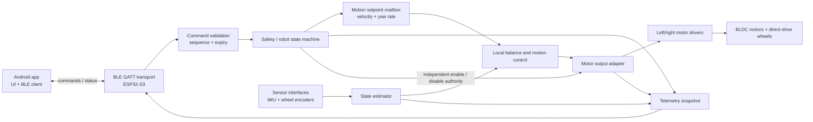

# Robot Software Architecture

## Goals and constraints

- Keep sensor acquisition, state estimation, balancing, motor actuation, safety, and remote control independently testable.
- Keep the balancing loop deterministic and entirely local to the ESP32-S3. The Android phone sends bounded motion requests; it never closes the balance loop.
- Put board- and module-specific details behind interfaces so uncertain hardware can be replaced without rewriting control logic.
- Treat safety state and motor-disable capability as higher authority than commands from the phone.

This architecture is scaffolded with ESP-IDF/C++ firmware and a native Kotlin Android app. Sensor and motor hardware drivers, balance control, and BLE GATT are intentionally nonfunctional placeholders until board details and safety limits are verified. See the current hardware assumptions and unresolved specifications in [the hardware architecture](../hardware/architecture.md) and [BOM](../hardware/BOM.md).

## System-level components



## ESP32-S3 firmware modules

| Module | Responsibility | Must not do |
|---|---|---|
| `board` | Pin map, clocks, peripheral ownership, compile-time board configuration, hardware revision notes | Contain balance-control math or app protocol logic |
| `hal` | Small interfaces for time, GPIO, SPI/I²C, PWM, ADC, and critical sections | Hide timing/error information that higher layers need |
| `drivers/imu` | Read the selected GY-6500/GY-9250-compatible module; report timestamped raw samples and device/error status | Assume the fitted chip variant, axes, or bus without configuration/verification |
| `drivers/encoder` | Read each AS5048A angle over SPI or PWM; unwrap angle and provide timestamped angle/velocity plus status | Treat magnetic angle as calibrated wheel speed without direction/zero checks |
| `drivers/motor` | Convert normalized or physical actuator requests into the confirmed DRV8313 board's supported PWM/enable signals; expose fault and disable | Assume board-level current sensing, 3-PWM/6-PWM mode, or safe current limits before verified |
| `sensing` | Calibration, coordinate transforms, units, plausibility checks, sensor freshness | Perform network I/O or block the control task |
| `estimation` | Fuse accelerometer and gyro into body pitch/rate; use encoder data for wheel speed; maintain estimator validity | Depend on phone telemetry or UI timing |
| `control/balance` | Stabilize body angle/rate and request wheel torque/voltage within configured limits | Read BLE, print logs, allocate dynamically, or directly manipulate transport state |
| `control/motion` | Convert requested forward velocity and yaw rate to bounded wheel targets, with acceleration limits | Bypass the balance controller or safety limits |
| `safety` | Own arm/disarm/fault transitions, command lease expiry, watchdog policy, output limits, and motor-enable permission | Allow remote commands to clear latched critical faults without explicit local policy |
| `comms/protocol` | Decode/encode versioned messages, validate lengths/units/ranges/sequence, produce command events | Directly call a motor driver or controller from a BLE callback |
| `comms/ble` | BLE pairing, GATT service/characteristics, connect/disconnect events, send/receive queues | Run balancing or block the real-time task |
| `telemetry` | Publish a bounded, coherent snapshot of state, sensor validity, battery/health, commands, and faults | Read live mutable control data piecemeal from the Android callback |
| `app` | Initialize components, configure tasks, inject dependencies, and connect event queues | Accumulate hardware-specific logic that belongs in modules |

### Key internal interfaces

Use explicit units, timestamps, and validity flags. Favor plain fixed-size data structures and queues/mailboxes over shared unprotected mutable state.

- `ImuSample`: timestamp, gyro rad/s, acceleration m/s², optional magnetic field, validity/error flags.
- `WheelMeasurement`: timestamp, left/right angle rad, angular velocity rad/s, validity/error flags.
- `MotionRequest`: forward velocity m/s, yaw rate rad/s, sequence number, received time, expiry/deadline.
- `ActuatorRequest`: left/right bounded torque or voltage request, validity, and requested enable state. Final output is still gated by `safety`.
- `RobotStatus`: state, pitch/rate, wheel speeds, command age, battery voltage if measured, driver/sensor health, and latched fault code.

Exact actuator units and control mode depend on the selected driver boards and whether usable phase-current sensing exists. Keep that choice behind `MotorDriver` rather than promising torque control prematurely.

## Real-time scheduling

Start with separate responsibilities, not necessarily one task per module:

1. **Balance/control task (highest priority):** fixed-rate timer-driven task. Acquire or consume fresh IMU/encoder samples, update estimate, execute balance and motion control, apply output limits, and write outputs. Measure worst-case execution time, jitter, and deadline misses. Initial loop period is TBD until sensor bus rate and driver interface are measured.
2. **Sensor acquisition:** synchronous acquisition inside the control task is acceptable for short, bounded transfers; otherwise a dedicated high-priority acquisition task publishes timestamped samples. Avoid unbounded waits and stale-data reuse.
3. **BLE/protocol task:** handle GATT callbacks/events, decode requests, authorize and enqueue bounded commands. Never run FOC or balance-control work in a BLE callback.
4. **Safety/health supervision:** evaluate command lease, watchdogs, data freshness, driver faults, battery state if measured, and arming conditions. Safety checks that must stop actuation run in or are atomically enforced by the control/output path.
5. **Telemetry/logging task:** publish sampled snapshots at a low rate and perform nonblocking logging. Telemetry must be lossy/bounded under load rather than delaying control.

No heap allocation, blocking network I/O, verbose logging, file operations, or mutex waits with unbounded duration in the balance loop. Define what happens on each deadline miss; repeated misses, stale IMU/encoder data, or invalid estimates must force a safe output and enter a fault/disarmed state according to severity.

## Safety state machine

Suggested states:

- `BOOT`: outputs hardware-disabled; initialize peripherals and self-tests.
- `DISARMED`: motors disabled; allow status/configuration and sensor checks.
- `READY`: checks pass and robot is within an allowed tilt window; explicit arm action accepted.
- `BALANCING`: local controller active; remote motion request may be zero or bounded.
- `REMOTE_LOST`: expire the motion request, command zero travel/yaw, and continue local balancing only while sensors, controller, drivers, and battery conditions remain healthy. If balance cannot be maintained, disable outputs. Do not let a phone disconnect cause uncontrolled last-command continuation.
- `FAULT`: disable both drivers for critical faults; latch faults that require explicit inspection/reset.

Arming should require fresh valid sensors, known calibration, motor drivers healthy/disabled until arm, valid battery/power conditions where measured, and an explicit local/remote arming action. Set pitch, wheel speed, acceleration, and motor-output limits from verified hardware and controlled experiments. A physical hardware motor-disable and accessible battery disconnect remain required; Android disarm is not an emergency stop.

## Android remote control

### Recommended first transport: BLE GATT

BLE is the recommended initial link for an Android controller because it works without an access point and fits low-rate commands/status. It is not deterministic and is not part of the stabilization loop. Use Wi-Fi later only if a concrete requirement demands higher-rate telemetry or networking.

Keep Android app concerns separated:

- `connection`: scanning, pairing, connect/disconnect, reconnect policy, link quality.
- `protocol`: versioned message encode/decode and compatibility checks.
- `control_ui`: dead-man control pad/joystick, explicit arm/disarm, clear link/armed state and fault indication.
- `telemetry`: state/pitch/speed/battery (if available), sensor/driver health, command age.
- `settings`: calibration/configuration only while disarmed; validate before writing and support reading back active values.

### Initial command/status contract

Use a versioned protocol over GATT characteristics (or framed messages over a write/notify pair). The scaffold currently defines a 15-byte little-endian control packet: `version:u8`, `type:u8`, `sequence:u16`, `forward_velocity_m_s:f32`, `yaw_rate_rad_s:f32`, `flags:u8` (arm/deadman), and `lease_ms:u16`. Android and firmware encoders/decoders must stay byte-for-byte compatible. The GATT UUIDs in the Android scaffold are placeholders until the ESP32 service is implemented.

- **Control write:** `version`, `sequence`, `forward_velocity_mps`, `yaw_rate_rad_s`, `arm_request`, and command lease/expiry. Clamp against firmware limits; reject malformed, stale, unsupported-version, and out-of-order commands.
- **Heartbeat/dead-man:** control commands renew a short lease while the user deliberately holds the control. On lease expiration, clear motion and enter `REMOTE_LOST`; never hold the last nonzero setpoint indefinitely.
- **Status notify:** `version`, `sequence`, robot state, pitch/rate, left/right wheel speed, measured battery voltage (only if hardware provides it), sensor/driver health, active limits, and fault code.
- **Configuration:** separate read/write path. Writes accepted only in `DISARMED`, range checked, and acknowledged with the applied value. Critical gains should not be exposed as casual live controls.

Use authenticated BLE pairing/bonding and encrypted characteristics for control. Keep command and telemetry rates modest; command rate and lease duration must be tuned to connection behavior and safety tests. Do not transmit raw PWM commands from Android.

## Proposed repository layout

```text
firmware/
  CMakeLists.txt                 # or selected build-system entry point
  main/
    app_main.cpp                 # composition root / startup
  components/
    board/                        # DevKitC-1 pins and board config
    hal/                          # ESP-IDF adapters and common interfaces
    drivers/
      imu/
      as5048a/
      drv8313_board/
    sensing/
    estimation/
    control/
      balance/
      motion/
    safety/
    comms/
      protocol/
      ble/
    telemetry/
  test/
    unit/
    simulation/
    hardware/
android/
  app/
    connection/
    protocol/
    control_ui/
    telemetry/
    settings/
docs/
  hardware/
  software/
```

The layout is a starting convention, not a mandate to create a separate package for every class. Keep modules small, interfaces stable, and add folders when code exists. The scaffold uses ESP-IDF/FreeRTOS and native Kotlin/Gradle. BLE is represented by an interface/stub; no GATT service or radio control is active yet. Validate compatibility with the chosen motor-control library and board before implementing the hardware adapter.

## Test strategy and implementation order

1. Record actual board revisions, IMU/encoder IC markings, driver interfaces/current-sense capability, motor pole pairs/current limits, wheel dimensions, and safe-disable pin behavior.
2. Define units, coordinate/sign conventions, fixed-size data interfaces, robot state machine, and protocol version before adding app controls.
3. Implement protocol validation, safety transitions, limiters, angle transforms, and estimator/control math as host-testable code where practical.
4. Build bench-only firmware for sensors, encoder direction/resolution, driver disable/fault behavior, battery-voltage measurement, and loop timing.
5. Bring up one motor at a time with wheels clear, conservative limits, and hardware disable verified; test fault and BLE-loss behavior.
6. Add a simulation/fake-driver implementation so control and safety can be tested without energized motors; proceed to closed-loop tests only when the driver/motor compatibility and safety checks pass.

Do not finalize loop rate, PID gains, motor current limits, BLE lease duration, or arm-angle thresholds from the current listing data alone; measure and validate against the actual hardware.
